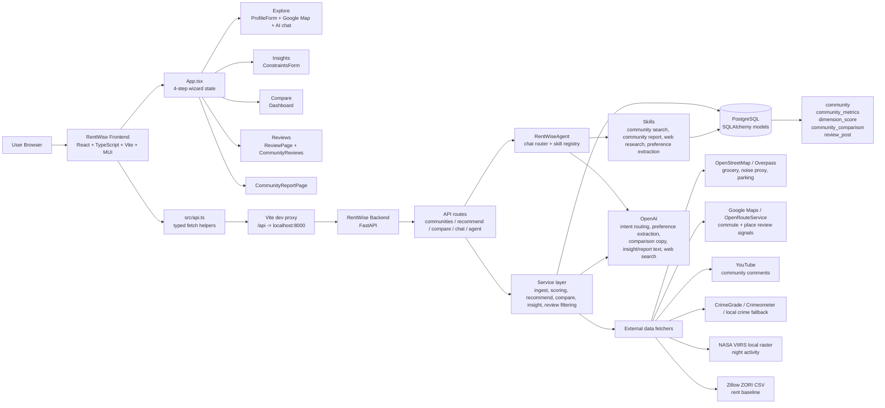

# RentWise Frontend

RentWise is a React frontend for comparing Irvine, CA rental communities. It helps renters explore neighborhoods, translate personal preferences into recommendation weights, compare community tradeoffs, and review supporting community feedback before choosing where to live.

This repository contains the frontend application. It expects the RentWise backend to provide community metrics, recommendation results, comparison summaries, AI chat responses, community reports, and review data.

Backend repository: https://github.com/Lujixian2002/Rentwise-Backend

## Team Members


| Name | Github |
| --- | --- |
| Kefei Wu | wukef2425 |
| Jason Wu | CyberObservers |
| Haofeng Li | noelistheone |
| Jixian Lu | Lujixian2002 |


## Features Implemented

- Four-step renter workflow: Explore, Insights, Compare, and Reviews.
- Interactive Google Map of Irvine communities with selectable neighborhoods.
- AI preference chat that turns natural-language renter needs into weights for safety, transit, convenience, parking, and environment.
- Personalized community recommendations based on backend scoring and frontend weight normalization.
- Neighborhood insight cards showing raw metrics, best-fit dimensions, and top preference drivers.
- Side-by-side community comparison with adjustable weights, server-generated summary, strengths, and tradeoffs.
- Community report page with metrics, dimension summaries, risk alerts, viewing checklist, sources, and agent trace.
- Review explorer with YouTube / Google Maps review data, word-cloud keyword filtering, and review sorting.
- Missing metric handling: communities with `null` values are tolerated, and missing data is excluded from weighted scoring where appropriate.

## Architecture



At runtime, the frontend is a Vite single-page app. `App.tsx` owns the wizard state and passes selected communities, weights, recommendation results, and comparison data into feature components. `src/api.ts` centralizes the backend contract, using `VITE_API_BASE_URL` or `/api` by default. During local development, `vite.config.ts` proxies `/api` to the FastAPI backend on port `8000`.

The backend repository is a FastAPI service with route modules under `app/api/routes`, business logic under `app/services`, agent workflows under `app/agents`, reusable skills under `app/skills`, and SQLAlchemy persistence under `app/db`. The backend keeps cached community metrics and review posts in PostgreSQL, refreshes stale data through fetchers, computes dimension scores, and optionally calls OpenAI for natural-language chat, summaries, reports, and web-grounded community context.

Key frontend files:

```text
src/
  main.tsx                 # React entry point
  App.tsx                  # Wizard state, data loading, step orchestration
  api.ts                   # Backend API helpers and response types
  logic.ts                 # Weight normalization, local scoring helpers, top drivers
  types.ts                 # Shared frontend domain types
  googleMapsLoader.ts      # Google Maps script loader
  components/
    ProfileForm.tsx        # Step 1: map, community selection, AI preference chat
    ConstraintsForm.tsx    # Step 2: selected-community insights
    Dashboard.tsx          # Step 3: comparison view
    CommunityReportPage.tsx # Detailed AI-generated community report
    ReviewPage.tsx         # Step 4: review page wrapper
    CommunityReviews.tsx   # Review list, word cloud, keyword filtering
    NavigationStepper.tsx  # Step navigation
    Header.tsx             # App header
```

Main API routes used by the frontend:

- `GET /communities`
- `GET /communities/:id`
- `POST /communities/:id/insight`
- `GET /communities/:id/reviews`
- `GET /communities/review-keyword-config`
- `POST /recommend`
- `POST /compare`
- `POST /agent/chat`
- `POST /agent/community-report`

Backend code areas that support those calls:

```text
app/main.py                  # FastAPI app, CORS, route registration
app/api/routes/              # REST endpoints used by the frontend
app/services/ingest_service.py
                             # cache-first metric/review refresh pipeline
app/services/scoring_service.py
                             # dimension scores and weighted recommendation scoring
app/services/recommend_service.py
                             # ranks communities from preference weights
app/services/compare_service.py
                             # side-by-side scoring plus optional LLM summary
app/services/insight_service.py
                             # insight cards from metrics, reviews, and optional web info
app/agents/rentwise_agent.py # orchestrates agent skills for chat/search/report
app/agents/chat_agent.py     # routes chat intent to skills
app/skills/                  # community search, report, web research, preference extraction
app/services/fetchers/       # external data integrations
app/db/models.py             # community, metrics, scores, comparisons, reviews
```

Primary data flow:

1. `GET /communities` loads cached communities and metrics for the Explore step.
2. `POST /agent/chat` routes user messages through `RentWiseAgent`; preference messages call the preference extraction skill and return normalized weights.
3. `POST /recommend` normalizes weights, computes five dimension scores, ranks communities, and returns the top results.
4. `POST /communities/:id/insight` refreshes metrics/reviews if needed, computes preference scores, and generates insight commentary with fallback text when OpenAI is unavailable.
5. `POST /compare` resolves two communities, refreshes metrics, computes structured differences, and stores the comparison result.
6. `GET /communities/:id/reviews` returns cached review posts, with optional AI filtering support on the backend.
7. `POST /agent/community-report` uses the agent skill layer to create a detailed community report from database metrics, reviews, preferences, and source-aware research.

## Tech Stack

- React 19
- TypeScript 5
- Vite 7
- Material UI 7
- d3-cloud
- Google Maps JavaScript API
- ESLint 9
- Docker / Docker Compose for local containerized frontend development

## Setup Instructions

### 1. Clone the repository

```bash
git clone <frontend-repository-url>
cd Rentwise-Frontend
```

### 2. Install dependencies

```bash
npm ci
```

If `npm ci` fails with an unreachable registry such as `mirrors.cloud.tencent.com`, reset the registry and try again:

```bash
npm config set registry https://registry.npmjs.org
npm ci
```

### 3. Create environment file

Create `.env.local` in the frontend repository root:

```env
# Optional in local Vite development.
# If omitted, the frontend uses /api and Vite proxies requests to the backend.
VITE_API_BASE_URL=/api

# Required for the interactive Google Map in the Explore step.
VITE_GOOGLE_MAPS_API_KEY=your_google_maps_browser_key
```

Environment variables:

| Variable | Required | Description |
| --- | --- | --- |
| `VITE_API_BASE_URL` | No | Backend base URL. Defaults to `/api` for Vite proxy usage. |
| `VITE_GOOGLE_MAPS_API_KEY` | Yes for map | Browser key for the Google Maps JavaScript API. Without it, the map area displays an error banner. |

### 4. Start the backend

Start the RentWise backend before using the frontend:

```text
https://github.com/Lujixian2002/Rentwise-Backend
```

In local development, Vite proxies `/api` to:

```text
http://localhost:8000
```

If the backend runs on a different URL, set `VITE_API_BASE_URL` accordingly.

## How to Run Locally

### Option A: Run with npm

```bash
npm run dev
```

Open:

```text
http://localhost:5173
```

### Option B: Run with Docker Compose

```bash
docker compose -f docker-compose.frontend.yml up --build
```

Open:

```text
http://127.0.0.1:5173
```

Stop the container:

```bash
docker compose -f docker-compose.frontend.yml down
```

The Docker Compose configuration sets:

```text
VITE_API_PROXY_TARGET=http://host.docker.internal:8000
```

This lets the frontend container call a backend running on the host machine.

## Testing / Verification

Run static checks:

```bash
npm run lint
```

Run a production build:

```bash
npm run build
```

Preview the production build:

```bash
npm run preview
```

Recommended manual verification:

1. Start the backend and frontend.
2. Open `http://localhost:5173`.
3. Confirm the Explore page loads community data.
4. Confirm the Google Map renders when `VITE_GOOGLE_MAPS_API_KEY` is set.
5. Select a community and verify the Insights step displays metrics.
6. Use the AI chat to update preference weights and verify recommendations refresh.
7. Compare two communities and verify the comparison summary appears.
8. Open Reviews and verify review data, keyword filtering, and sorting work.
9. Open the community report page and verify the generated sections and sources load.

## Deployment / Local-Only Status

Current status: frontend is configured for local development and local Docker execution.

- Local npm dev server: supported.
- Local Docker Compose frontend: supported.
- Production build: supported through `npm run build`.
- Hosted deployment URL: TODO, add if deployed.
- Backend dependency: required for full functionality.

## Demo Video

TODO: Add final demo video link.

Suggested format:

```text
Demo video: https://...
```

## Known Issues / Future Work

- A Google Maps browser API key is required for the full Explore map experience.
- The frontend depends on the backend being available; most core features cannot run with static mock data only.
- Hosted deployment URL and demo video link still need to be added before final submission.
- Future work: add automated component tests for the four-step workflow.
- Future work: add end-to-end tests that run against a seeded backend.
- Future work: improve loading and empty-state coverage for partial backend data.

## Useful Commands

```bash
npm run dev       # Start local Vite dev server
npm run build     # Type-check and build production assets
npm run preview   # Preview production build locally
npm run lint      # Run ESLint
```
